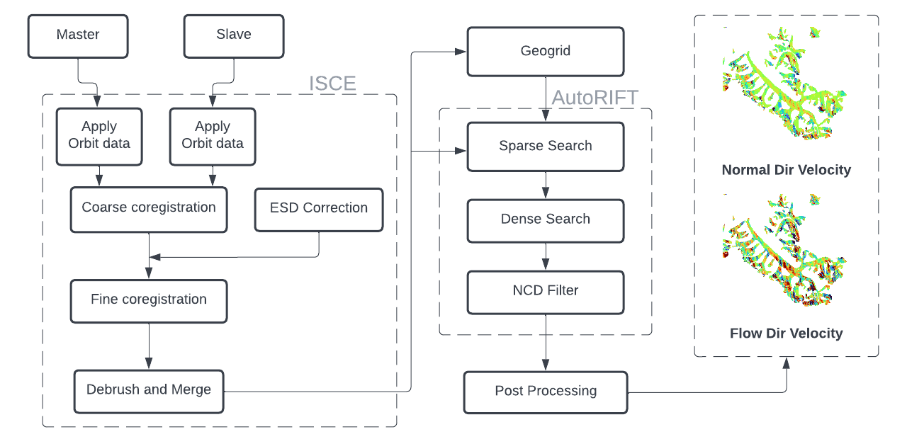

# Glacier Flow Analysis using SAR Data

This repo contains the code for fully automated SAR based Offset tracking which can be used in various applicaitons we have some demos showing Offset tracking for glacier velocity estimation. For feature tracking we have used [autoRIFT](https://github.com/nasa-jpl/autoRIFT.git) and for co-registration of SAR Images we have used [ISCE](https://github.com/isce-framework/isce2), we have provided instuctions on how to [install ISCE](docs/ISCE Installation.pdf).

We support processing a batch of SAR Image for velocity estimation as well.

### **Running Single Image Pair velocity estimation** 
The overall pipeline of single task processing is shown in figure below. We just need to provide the reference and secondary image pair URL, which can be obtained from [ASF Platform](https://search.asf.alaska.edu/#). Script ***single_process.py*** is used for single image pair velocity estimation, it takes in following parameters as input:-



* Reference Image URL (-reference) and Secondary Image URL(--secondary)
* Save path i.e. directory in which files will be saved (--save_path)
* Velocity output file names (--netCDF_out)
* DATA Config file containing coregistration parameters [DEFAULT](./configs/isce_config.json) (--config)

An example command calling single_process.py has been given below.
       
    python single_process.py --reference REFERENCE_URL --secondary SECONDARY_URL --save_path OUT_PATH --netCDF_out POST_FILENAME

```
usage: single_process.py [-h] [--reference REFERENCE] [--secondary SECONDARY]
                         [--save_path SAVE_PATH] [--netCDF_out NETCDF_OUT]
                         [--config CONFIG]

optional arguments:
  -h, --help            show this help message and exit
  --reference REFERENCE
                        URL of reference zip file
  --secondary SECONDARY
                        URL of secondary zip file
  --save_path SAVE_PATH
                        directory in which orbit file needs to be saved
  --netCDF_out NETCDF_OUT
                        Output netCDF file
  --config CONFIG       Data config file

```

***NOTE:*** The offset tracking chipsize and num of threads used can be changed from data_config.json, and the parameters for coregisteration can be changed from isce_config.json changing the Region of Interest. 

During coregisteration ISCE automatically downloads the DEM files which are then processed later automatically to generate DEM and Slope files for ROI.

After autoRIFT algorithm is performed on the coregistered Master and Slave image, the offset maps are then used to compute velocities in radar amd azimuth directions. After, which postprocessing can then be applied using a custom post-processing function defined in ***geogrid_autorift/util.py***. 


Output files may include all or few
```
"velocity.tif":           velocity in azimuth and range directions,
"offset.tif":             displacement offsets in azimuth and range directions, 
"testGeogrid.txt":        metadata of SAR image pairs, 
"Post-processed Output":  outputs generated from custom post-processing function, 
```

***NOTE:*** After execution of testGeogrid_ISCE.py copy the console outputs into testGeogrid.txt file, as the data from that file would be used by autoRIFT.

### **Running Batch of Image Pair for velocity estimation** 

For estimating velocity maps for a batch of images, we take in a CSV file as input which contains:

* Pair Name
* Master and Slave URL
* Region of Interest (lat/lon) --> Eg: [32.06, 32.77, 76.86, 77.82]
* Status

Here the batch process is divided in 2 process and can be run in parallel using script ***isce_batch.py*** and ***offset_batch.py***. The "status" in CSV provides the information regarding at which stage the process is at, Status=1 when coregisteration is completed and its waiting fot velocity estimation, at the same time the ones which are not able to complete have Status=-1. Similarly once velocity estimation is completed Status is changed to 2, and if its unsucessful its changed to -2.

For starting the execution of coregistration pipeline ***isce_batch.py*** should be used as shown below.

    python3 isce_batch.py --download_csv CSV_DATA --save_path OUTPUT_PATH --config CONFIG_PATH

```
usage: isce_batch.py [-h] [--save_path SAVE_PATH]
                     [--download_csv DOWNLOAD_CSV] [--config CONFIG]

optional arguments:
  -h, --help            show this help message and exit
  --save_path SAVE_PATH
                        directory in which orbit file needs to be saved
  --download_csv DOWNLOAD_CSV
                        Data CSV file
  --config CONFIG       Data config file
```

Parallel to execution coregisteration, the offset tracking pipeline can also be started which will check for Status=1 Image pairs and start computing velocity maps for them.

For starting the execution of offset tracking pipeline ***offset_batch.py*** should be used as shown below.

    python3 offset_batch.py --download_csv CSV_DATA --save_path OUTPUT_PATH --config CONFIG_PATH


```
usage: offset_batch.py [-h] [--save_path SAVE_PATH]
                       [--download_csv DOWNLOAD_CSV] [--config CONFIG]

optional arguments:
  -h, --help            show this help message and exit
  --save_path SAVE_PATH
                        directory in which orbit file needs to be saved
  --download_csv DOWNLOAD_CSV
                        Data CSV file
  --config CONFIG       Data config file
```

### **Post-processing**

For post-processing, we have used velocity in LOS and azimuth direction for computing velocity in flow direction, and rate of change of thickness of glacier, and visualised them in order to get a idea of spatial variation of flow.

The postprocessing function can be changed from ***geogrid_autorift/util.py***

We have performed all the steps in this [jupyter notebook](Post-Processing.ipynb).

