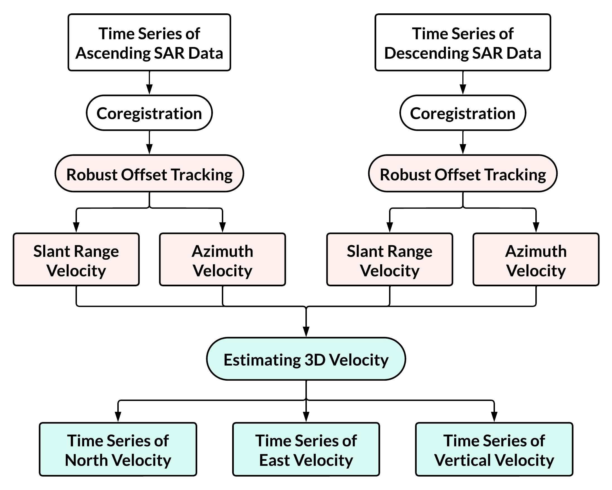

# Automated Glacier Flow Monitoring using SAR Data

This repo contains the code for fully automated SAR based glacier monitoring pipeline which generates a 12 days separated time-series velocity maps.

This pipeline currently only supports the use of Sentinel-1 data. 

## Introduction

To comprehend glacier dynamics for a region, a time-series study of glacier change is essential. However, generation of a large time series data often requires a substantial amount of computation and time. To address these limitations, we developed an efficient pipeline for processing of such large time-series Sentinel-1 imagery, generating extensive time series data for 3D glacier flow velocities.

For feature tracking we developed a robut offset tracking module, built on top of [autoRIFT](https://github.com/nasa-jpl/autoRIFT.git). It has been modified for performing offset tracking based on NCC stacking, using the time-series of coregistered SAR imagery. For co-registration of SAR Images we have used stack processing mode of [ISCE](https://github.com/isce-framework/isce2), please go through the instructions on how to [install ISCE](https://github.com/isce-framework/isce2/blob/main/README.md).

The overall pipeline of single task processing is shown in figure below. 

<!--  -->


## Running the pipeline

We just need to provide the list of scene names for both ascending and descending track Sentinel-1 images. They can be generated using SSARA as demonstrated in [`Pre-processing.ipynb`](/notebook/Pre-processing.ipynb). And other parameters are given through [configs files](/configs/). 

An example for [pipeline config](/configs/pipeline_config.json) is given,
```json
{
    "save_path": "/DATA/run_2017_19", # Workflow run directory
    "SAR_dir": "/DATA/S2_Data/",  # Sentinel-1 file save directiory
    "shapefile_dir": "/DATA/shapefiles/CB_glacier_buffer.shp",  # Glacier region shapefile
    "config_path": "/DATA/Automated_Offset_Tracking/configs/data_config.json",  # Data config file path
    "polarisation": "vv"  # Sentinel-1 polarisation to be used
}
```

Similarly, an example for [data config](/configs/data_config.json) is given,
```json
{
    "num_threads": 64,  # No. of cores to be used
    "chip_min": 240,    # Minimum chip size for offset tracking
    "chip_max": 960,    # Maximum chip size for offset tracking
    "Orbit_dir": "/DATA/S2_Data/orbit/",  # Orbit file save directory
    "aux_dir": "/DATA/S2_Data/aux/",  # Auxilary file save directory
    "cred_config": "config/credentials.json",  # Credentials json file
    "ROI": "[32.06, 32.60, 77.09, 77.82]"  # Area of interest
}

```
Script [***stack_pipeline.py***](/stack_pipeline.py) is used for running the pipeline, it takes in following parameters as input:-
* Ascending track scene list (-t_asc)
* Descending track scene list (-t_des)
* Pipeline config file (--config)

An example command calling single_process.py has been given below.

```bash
python single_process.py --reference REFERENCE_URL --secondary SECONDARY_URL --save_path OUT_PATH --netCDF_out POST_FILENAME
```

```
usage: stack_pipeline.py [-h] -t_asc DOWNLOAD_ASC_TXT -t_des DOWNLOAD_DES_TXT [--config CONFIG]

optional arguments:
  -h, --help            show this help message and exit
  -t_asc DOWNLOAD_ASC_TXT, --download_asc_txt DOWNLOAD_ASC_TXT
                        Data Ascending txt file
  -t_des DOWNLOAD_DES_TXT, --download_des_txt DOWNLOAD_DES_TXT
                        Data Descending txt file
  --config CONFIG       Pipeline config file

```

This involves first performing coregisteration of ascending track time-series SAR imagery followed by utilization of robust offset tracking for computing time series azimuthal and range velocity maps. Subsequently, the same is perfomed for descending track SAR imagery. Finally, velocity maps from both ascending and descending track imagery are utilized for computing 3D time-series velocity maps.


## Dependencies

* See [requirements txt file](/requirements.txt) for the list of Python packages
* [InSAR Scientific Computing Environment v2.6.3 (19 April 2023)](https://github.com/isce-framework/isce2/releases/tag/v2.6.3)


## References

* Y. Lei, A. Gardner and P. Agram. (2021). "Autonomous Repeat Image Feature Tracking (autoRIFT) and Its Application for Tracking Ice Displacement," in Remote Sens, 13, 749. https://doi.org/10.3390/rs13040749

* S. Li, S. Leinss and I. Hajnsek. (2021). Cross-Correlation Stacking for Robust Offset Tracking Using SAR Image Time-Series. IEEE JSTARS, vol. 14, pp. 4765-4778, https://doi.org/10.1109/JSTARS.2021.3072240.

* S. Samsonov, K. Tiampo and R. Cassotto. (2021). SAR-derived flow velocity and its link to glacier surface elevation change and mass balance. Remote Sensing of Environment. 258. 112343. https://doi.org/10.1016/j.rse.2021.112343. 


<!-- ### **Post-processing**

For post-processing, we have used velocity in LOS and azimuth direction for computing velocity in flow direction, and rate of change of thickness of glacier, and visualised them in order to get a idea of spatial variation of flow.

The postprocessing function can be changed from ***geogrid_autorift/util.py***

We have performed all the steps in this [jupyter notebook](Post-Processing.ipynb). -->
